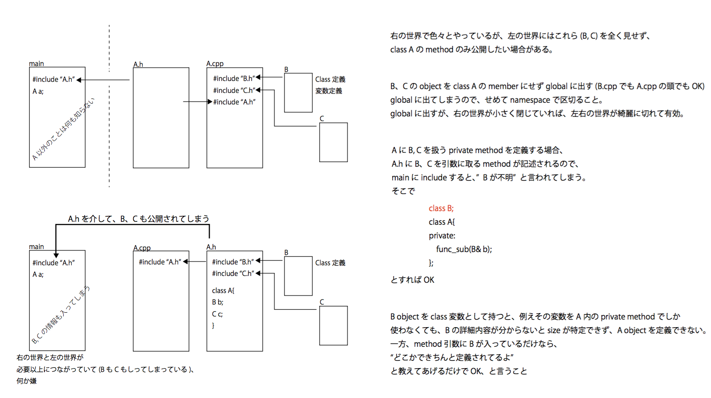

#study__OpenVerySmallEntrance_To_UserOfTheFunctionBlock

##環境
*	OS X El Capitan(10.11.6)
*	Xcode : 7.2

##add on

##Contents
右の世界では、class B, class Cなど使って色々とやっているが、  
左の世界にはこれらを全く見せず、 class A の method のみ公開したい場合がある。

  

##Device

##note

